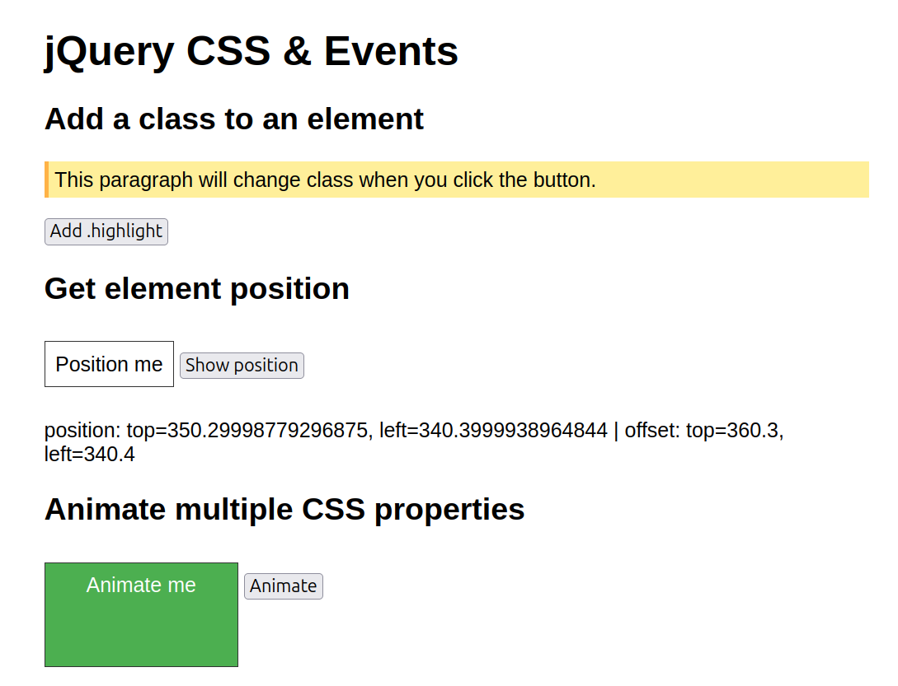
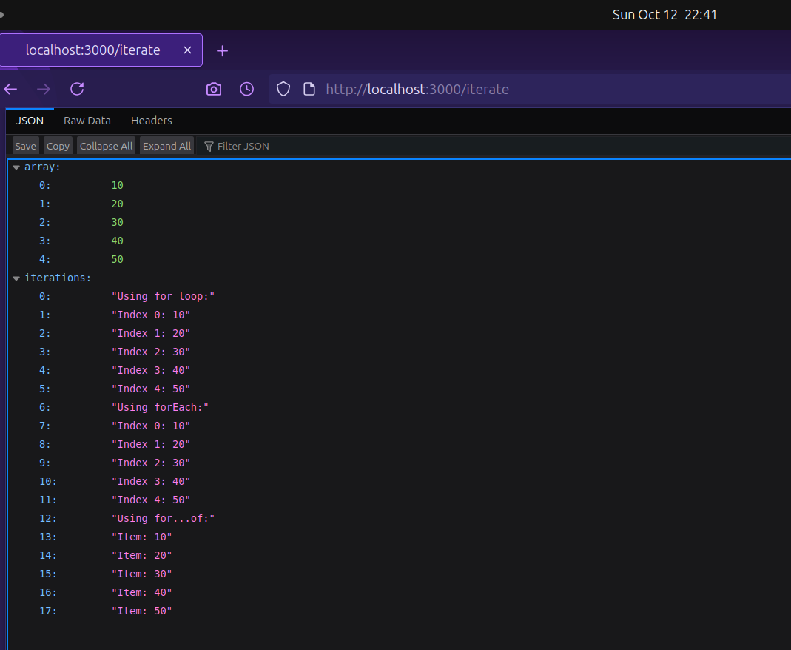
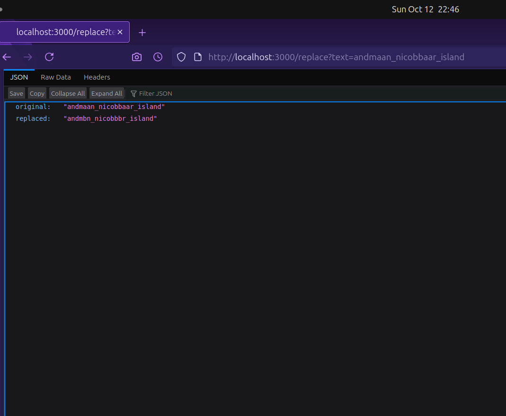
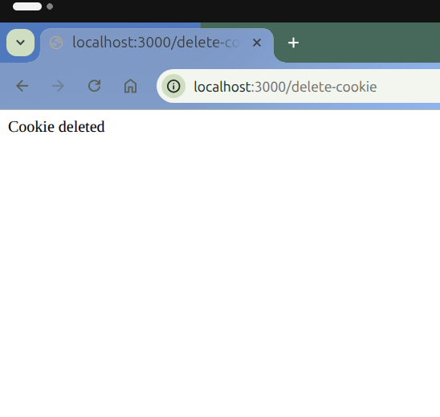
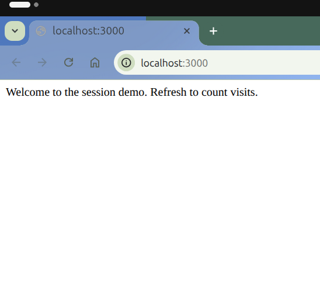

<h1 align="center" style="font-size:50px">Advance Web Tech Lab Report</h1>
<p><b>Name:</b> Shahid Khan</p>
<p><b>SAP ID:</b> 590018782</p>
<p><b>Date:</b> October 12, 2025</p>


<h2>Experiment Index</h2>

1.  **Experiment 1:** Basic JQuery implementation
2.  **Experiment 2:** JQUERY CSS AND events methods
3.  **Experiment 3:** Angular js (table and sorting)
4.  **Experiment 4:** Angular JS Forms and Events
5.  **Experiment 5 & 6:** Node JS Basics
6.  **Experiment 7:** Cookie and Sessions in nodejs
7. **Experiment 8 & 9:** Full Stack To-Do List (Node, Express, Mongo, Angular)
8. **Experiment 10:** D3.js Operations & Data Visualization
 
   
## Experiment 1

1. **Aim**  
   To create a webpage with interactive features using HTML, CSS, and jQuery, including disabling right-click, scrolling to the top, changing paragraph color on mouseover, and showing/hiding a message.

2. **Brief Description**  
   This experiment develops a webpage featuring a button to disable right-click, an image to scroll to the top, a paragraph that changes color on mouseover, and a button to toggle the visibility of a message, all styled with CSS and controlled using jQuery.

3. **Explanation**  
   I created an HTML structure with a button, an image, a paragraph, and another button for message control. CSS was used to center the content, style the button and image, and position elements. jQuery handles the right-click disable on button click, scrolls to the top when the image is clicked, changes the paragraph color on hover, and toggles the message visibility with button text updates.

4. **All the code**  

   **index.html**  
   ```html
   <!-- EXPERIMENT 1  -->
   <!DOCTYPE html>
   <html lang="en">
   <head>
      <meta charset="UTF-8">
      <meta name="viewport" content="width=device-width, initial-scale=1.0">
      <title>Document</title>
      <script src="https://code.jquery.com/jquery-3.6.0.min.js"></script>
      <link rel="stylesheet" href="index.css">
   </head>
   <body>
      <button>DISABLE RIGHT CLICK
      </button>
      
      <p id="one">THIS PARAGRAPH WILL CHANGE IT'S COLOR ON MOUSEOVER</p>
      <h2 id="out">Button clicked</h2>
      <button id="sh">SHOW MESSAGE</button>
      <script src="index.js">
      </script>
   </body>
   </html>
   ```

   **index.css**  
   ```css
   body {
       display: flex;
       justify-content: center;
       align-items: center;
       height: 100vh;
       background-color: black;
       height: 1000px;
       color: rgb(183, 0, 255)
   }
   button {
       height: 150px;
       width: 200px;
       color: red;
       font-weight: 900;
   }

   /* scroll image to get to top */
   img {
       position: fixed;
       bottom: 20px;
       right: 10px;
       height: 100px
   }

   /* Change color on mouseover */
   #one {
       position: absolute;
       top: 30px;
   }

   /* show/hide message on button click */
   #out {
       display: none;
       top: 80px;
       position: absolute;
       color: brown;
   }
   ```

   **index.js**  
   ```javascript
   //DISABLE RIGHT CLICK 
   $(function(){
       $("button").on('click',function(){
           $("body").on('contextmenu',function(z)
       {
           z.preventDefault()
       })

       })
   });
   //CLICK IMAGE TO SCROLL TO TOP
   $(function(){
       $("#scrolltopimg").on('click',function(){
       $("body ,html").animate({scrollTop:0},500);
    });
   });

   //CHANGE PARAGRAPH COLOR ON MOUSEOVER
   $("p").hover(function(){
       $("#one").css({"color":"red","cursor":"pointer"});
   },
   function(){
   $(this).css("color","")
   })
   //show/hide message on button click
   $("#sh").on('click',function()
   {
       if($("#out").is(':hidden'))
       {   $("#out").show();
           $("#sh").text("HIDE MESSAGE")
       }
       else{
           $("#out").hide();
           $("#sh").text("SHOW MESSAGE")
       }
   })
   ```

5. **Paste output**  
   <code></code>

6. **What I learned**  
   I learned how to implement jQuery for event handling, DOM manipulation, and animations, along with CSS for layout and styling, to create an interactive webpage.

7. **Challenges Faced**  
   Ensuring the right-click disable triggered only after the button click and aligning the hover effect properly with CSS positioning were initial challenges.


<br><br><br><br><br>


# **Experiment 2: JQUERY CSS AND events methods**

1. **Aim**  
   To demonstrate the use of jQuery for manipulating CSS classes, retrieving element positions, and animating multiple CSS properties.

2. **Brief Description**  
   This experiment creates a webpage with three interactive sections: adding a CSS class to a paragraph, displaying an element's position, and animating a div with multiple CSS properties, all using jQuery and styled with CSS.

3. **Explanation**  
    I structured the HTML with three sections, each with a heading, an element to manipulate, and a button to trigger the action. CSS was used to style the elements and define the highlight and animation-complete classes. jQuery adds a class to a paragraph on button click, retrieves and displays an element's position on button click, and animates a div's properties on button click with a color change afterward.

4. **All the code**  

   **index.html**  
   ```html
   <!doctype html>
   <html>
   <head>
     <meta charset="utf-8">
     <title>Experiment 2 - jQuery CSS and Events</title>
     <link rel="stylesheet" href="style.css">
     <script src="https://code.jquery.com/jquery-3.6.0.min.js"></script>
   </head>
   <body>
     <div class="container">
       <h1>jQuery CSS & Events</h1>

       <section id="add-class">
         <h2>Add a class to an element</h2>
         <p id="para">This paragraph will change class when you click the button.</p>
         <button id="btn-add">Add .highlight</button>
       </section>

       <section id="position">
         <h2>Get element position</h2>
         <div id="pos-box">Position me</div>
         <button id="btn-pos">Show position</button>
         <p id="pos-output"></p>
       </section>

       <section id="animate">
         <h2>Animate multiple CSS properties</h2>
         <div id="anim-box">Animate me</div>
         <button id="btn-anim">Animate</button>
       </section>
     </div>

     <script src="app.js">
     </script>
   </body>
   </html>
   ```

   **style.css**  
   ```css
   body { font-family: Arial, sans-serif; padding: 20px; }
   .container { max-width: 800px; margin: auto; }
   #pos-box, #anim-box { border: 1px solid #333; padding: 10px; display:inline-block; margin:10px 0; }
   .highlight { background: #ffef9a; border-left: 4px solid #ffb347; padding: 6px; }
   .anim-done { color: #fff; background: #4caf50; }
   ```

   **app.js**  
   ```javascript
   $(document).ready(function() {
     // 1. Add class to an element
     $("#btn-add").click(function() {
       $("#para").addClass("highlight");
     });

     // 2. Access position of an element
     $("#btn-pos").click(function() {
       // position() gives position relative to offset parent
       const pos = $("#pos-box").position();
       // offset() gives document position
       const off = $("#pos-box").offset();
       $("#pos-output").text(`position: top=${pos.top}, left=${pos.left}  |  offset: top=${off.top.toFixed(1)}, left=${off.left.toFixed(1)}`);
     });

     // 3. Animate multiple CSS properties
     $("#btn-anim").click(function() {
       $("#anim-box").animate({
         paddingLeft: "40px",
         paddingRight: "40px",
         height: "80px"
       }, 700, function() {
         // after animation, change color via CSS class (color cannot be animated via jQuery animate without plugin)
         $(this).addClass("anim-done");
       });
     });
   });
   ```

5. **Paste output**  
   <p><strong>Output:</strong></p>
  <code ><code>
6. **What I learned**  
   I learned how to use jQuery to add CSS classes, retrieve element positions, and animate multiple properties, along with basic CSS styling for visual effects.

7. **Challenges Faced**  
   Understanding the difference between `position()` and `offset()` methods and ensuring the animation completed with the correct color change were initial hurdles.

<br><br><br><br><br>

#  **Experiment 3:AngularJS**

1. **Aim**  
   To display a table using AngularJS with `ng-repeat`, sort table contents using the `orderBy` filter, and style rows differently for even and odd rows.

2. **Brief Description**  
   This experiment creates a webpage with two tables displaying student data, one with dynamic headers and rows using `ng-repeat`, and another sortable by name, age, or department with a reverse option, styled with alternating row colors using AngularJS.

3. **Explanation**  
    I set up an HTML structure with two tables and a dropdown for sorting. AngularJS was used to populate the tables with student data using `ng-repeat`, generate headers from the first row, and implement the `orderBy` filter with a checkbox for reverse sorting. CSS was applied to center the content and style the tables with different backgrounds for even and odd rows.

4. **All the code**  

   **index.html**  
   ```html
   <!DOCTYPE html>
   <html lang="en" ng-app="myapp">
   <head>
       <meta charset="UTF-8">
       <meta name="viewport" content="width=device-width, initial-scale=1.0">
       <title>Document</title>
       <link rel="stylesheet" href="style.css">
       <script src="https://ajax.googleapis.com/ajax/libs/angularjs/1.8.2/angular.min.js"></script>
   </head>
   <body ng-controller="mctrl">
       <p> 1. Display a table using AngularJS and `ng-repeat`.<br>
           2. Use `orderBy` filter to sort table contents.<br>
           3. Style rows differently for even and odd rows.</p>
           <br>
       <table ID="f" >
           <tr>
                <th ng-repeat="(key,value) in students[0]">{{key}}</th> 
                <!-- Prints the keys of data only once because it is bound to first row  -->
           </tr>
           <tr ng-repeat="student in students">
               <td ng-repeat="(key,value) in student">{{value}}</td>
           </tr>
       </table>
       <br>
       <section>
           Display contents with order by filter
           <label for="">Order BY:</label>
          <select name="" ng-model="sortkey" id="">
           <option value="name">Name</option>
           <option value="age">Age</option>
           <option value="dept">Dept</option>
          </select>
          <label for="">Reverse:
           <input type="checkbox" ng-model="reverse">
          </label>
       </section>
       <TABLE id="s">
           <tr><th>NAME</th>
           <TH>AGE</TH>
       <TH>DEPARTMENT</TH></tr>
       <tr ng-repeat="student in students|orderBy:sortkey:reverse">
           <!-- When the user choose sort by Name orderBy:sortkey changes to orderBy:Name and similarly so on
            and when  the value in checkbox is true then sorting is reversed-->
           <td>{{student.name}}</td>
           <td>{{student.age}}</td>
           <td>{{student.dept}}</td>
       </tr>
       </TABLE>
       <script src="app.js"></script>
   </body>
   </html>
   ```

   **style.css**  
   ```css
   /* Center content horizontally and stack vertically */
   body {
       display: flex;
       flex-direction: column;  /* stack tables one below the other */
       align-items: center;     /* center horizontally */
       margin: 0;
       padding: 20px;
       font-family: Arial, sans-serif;
   }

   /* General table styling */
   table {
       border-collapse: collapse;
       width: 300px;
       text-align: center;
       margin: 20px 0;          /* spacing between tables */
       box-shadow: 0 2px 6px rgba(0,0,0,0.2);
   }

   /* Borders */
   table, th, td {
       border: 2px solid black;
       padding: 8px;
   }

   /* Header row */
   th {
       background: #eee;
       font-weight: bold;
   }

   /* Odd-even row styling */
   tr.even { background: #f8f8f8; }
   tr.odd  { background: #191717; color: white; }

   /* Sections and paragraph layout */
   section, p {
       display: block;
       margin: 10px 0;
   }
   ```

   **app.js**  
   ```javascript
   var app =angular.module('myapp',[]);
   app.controller('mctrl',function($scope){
     $scope.students = [
         { name: 'Asha', age: 22, dept: 'CSE' },
         { name: 'Bikram', age: 24, dept: 'ECE' },
         { name: 'Charu', age: 21, dept: 'ME' },
         { name: 'Deep', age: 23, dept: 'CSE' },
         { name: 'Esha', age: 20, dept: 'EE' }
       ];
   })
   ```
   <p><strong>Output:</strong></p>


1. **What I learned**  
   I learned how to use AngularJS for dynamic table rendering with `ng-repeat`, implement sorting with the `orderBy` filter, and apply CSS to differentiate even and odd rows.

2. **Challenges Faced**  
   Ensuring the table headers were generated correctly from the first row and debugging the reverse sorting logic with the checkbox were initial difficulties.

---

<br><br><br><br><br>

# **Experiment 4 Angular JS Forms and Validations**

1. **Aim**  
   To create a bill payment record system and a user registration form with input validation using AngularJS.

2. **Brief Description**  
   This experiment includes a bill payment record system with add, edit, and delete functionalities, and a separate registration form with basic input validation, both implemented using AngularJS with minimal styling.

3. **Explanation**  
   I created two HTML files: one for a bill payment system with a form to add or update bills and a table to display them, and another for a registration form with name and age fields. AngularJS handles form submission, data storage in memory, editing, and deletion for bills, while the registration form includes validation for required fields and minimum length, with error messages displayed on touch or submission.

4. **All the code**  

   **bill_payment.html**  
   ```html
   <!DOCTYPE html>
   <html ng-app="billApp">
   <head>
     <title>Bill Payment Record</title>
     <script src="https://ajax.googleapis.com/ajax/libs/angularjs/1.8.2/angular.min.js"></script>
   </head>
   <body ng-controller="billController">

     <h2>Bill Payment Record</h2>

     <!-- Form for Adding/Updating Bills -->
     <form ng-submit="saveBill()">
       <label>Bill Name:</label>
       <input type="text" ng-model="newBill.name" placeholder="e.g. Electricity" required>
       <br><br>

       <label>Amount:</label>
       <input type="number" ng-model="newBill.amount" placeholder="e.g. 1200" required>
       <br><br>

       <label>Date:</label>
       <input type="date" ng-model="newBill.date" required>
       <br><br>

       <button type="submit">{{ editIndex === -1 ? "Add Bill" : "Update Bill" }}</button>
       <button type="button" ng-click="clearForm()">Clear</button>
     </form>

     <hr>

     <!-- Display Bills -->
     <h3>All Bills</h3>
     <table border="1" cellpadding="8">
       <tr>
         <th>#</th>
         <th>Bill Name</th>
         <th>Amount</th>
         <th>Date</th>
         <th>Actions</th>
       </tr>
       <tr ng-repeat="bill in bills track by $index">
         <td>{{$index + 1}}</td>
         <td>{{bill.name}}</td>
         <td>{{bill.amount}}</td>
         <td>{{bill.date | date : 'dd-MM-yyyy'}}</td>
         <td>
           <button ng-click="editBill($index)">Edit</button>
           <button ng-click="deleteBill($index)">Delete</button>
         </td>
       </tr>
     </table>

     <script>
       var app = angular.module("billApp", []);
       app.controller("billController", function($scope) {
         $scope.bills = []; // in-memory storage
         $scope.newBill = {};
         $scope.editIndex = -1;

         // Save (Add or Update)
         $scope.saveBill = function() {
           if ($scope.editIndex === -1) {
             // Add new bill
             $scope.bills.push({
               name: $scope.newBill.name,
               amount: $scope.newBill.amount,
               date: $scope.newBill.date
             });
           } else {
             // Update existing bill
             $scope.bills[$scope.editIndex] = angular.copy($scope.newBill);
             $scope.editIndex = -1;
           }
           $scope.newBill = {}; // clear form
         };

         // Edit a bill
         $scope.editBill = function(index) {
           $scope.newBill = angular.copy($scope.bills[index]);
           $scope.editIndex = index;
         };

         // Delete a bill
         $scope.deleteBill = function(index) {
           $scope.bills.splice(index, 1);
         };

         // Clear form
         $scope.clearForm = function() {
           $scope.newBill = {};
           $scope.editIndex = -1;
         };
       });
     </script>

   </body>
   </html>
   ```

   **registration.html**  
   ```html
   <!-- Create a user registration form and perform input validation using AngularJS. -->
   <!DOCTYPE html >
   <html lang="en" ng-app="app">
   <head>
       <meta charset="UTF-8">
       <meta name="viewport" content="width=device-width, initial-scale=1.0">
       <title>Document</title>
       <link rel="stylesheet" href="style.css">
       <script src="https://ajax.googleapis.com/ajax/libs/angularjs/1.8.2/angular.min.js"></script>
   </head>
   <body ng-controller="ctr">
     <h1>REGISTRATION PAGE</h1>
   <form name="reg" ng-submit="submitform()">
     <label >Enter your name:
       <input type="text" name="name" ng-model="name" required ng-minlength="3"></label>
     <div class="error"  ng-show="(reg.name.$touched || submitted) && reg.name.$error.required" >
       Name must be entered correctly</div>

       <br>
       <label for="age"> AGE:
         <input type="number" ng-model="age" name="age">
         <div id="ageerror" ng-show="(reg.age.$touched ||submitted) && re.age.$error.required">
           Age Must be a number
         </div>
       </label>
     <button type="submit" name="btn" >Submit</button>
   </form>
      <script>
   var app =angular.module('app',[]);
   var ctrl =app.controller('ctr',function($scope){
     $scope.submitted=false;
     $scope.submitform=function(){
       $scope.submitted=true

     }

   })

      </script>
   </body>
   </html>
   ```

   **style.css**  
   ```css
   body {
       min-height: 100vh;
       display: flex;
       justify-content: center;
       align-items: center;
       background: #f0f0f0;
       flex-direction: column;
   }
   h1{display: block;text-align: center;}
   #hcontainer{text-align: center;top:20px}
   #reg {
       width: 400px;
       height: 700px;
       background-color: rgba(0,0,0,0.5); 
       border-radius: 10px;
       box-shadow: 0 4px 16px rgba(0,0,0,0.2);
       padding: 32px 24px;
       display: flex;
       flex-direction: column;
       justify-content: center;
   }
   ```

        <p><strong>Output:</strong></p>


     <p><strong>Output:</strong></p>


 **What I learned**  
   I learned how to use AngularJS for form handling, data management, and input validation, including dynamic table updates and error messaging.

1. **Challenges Faced**  
   Fixing the typo in the age validation condition (`re.age` to `reg.age`) and ensuring form clearing worked correctly after submission were initial issues.

<br><br><br><br><br>

# **Experiment 5 & 6: Node JS Basics**

1. **Aim**  
   To set up a Node.js server with endpoints for a Hello World message, string replacement, calculation, and array iteration.

2. **Brief Description**  
   This experiment creates a single Node.js server with multiple GET endpoints: a basic Hello World, a string replacement function, a calculator for basic operations, and an array iteration example using different loop types, all handled with Express.

3. **Explanation**  
    I set up an Express server and defined four endpoints. The root endpoint returns a simple message, the `/replace` endpoint replaces multiple consecutive 'a's with 'b' in a query string, the `/calculate` endpoint performs arithmetic operations based on query parameters, and the `/iterate` endpoint demonstrates array iteration using for loop, forEach, and for...of, logging results in JSON.

4. **All the code**  

   **index.js**  
   ```javascript
   const express = require('express');
   const app = express();
   const port = 3000;
   // Hello World endpoint
   app.get('/', (req, res) => {
     res.send('Hello, World!');
   });
   // String replacement endpoint
   app.get('/replace', (req, res) => {
     const { text } = req.query;
     if (!text) {
       return res.status(400).json({ error: 'Text parameter is required' });
     }
    
     const regex = /a{2,}/g;
     const result = text.replace(regex, 'b');
     res.json({ original: text, replaced: result });
   });
   // Calculator endpoint
   app.get('/calculate', (req, res) => {
     const { operation, num1, num2 } = req.query;
     const n1 = parseFloat(num1);
     const n2 = parseFloat(num2);
    
     if (isNaN(n1) || isNaN(n2)) {
       return res.status(400).json({ error: 'Invalid numbers provided' });
     }
    
     let result;
     switch(operation) {
       case 'add':
         result = n1 + n2;
         break;
       case 'subtract':
         result = n1 - n2;
         break;
       case 'multiply':
         result = n1 * n2;
         break;
       case 'divide':
         result = n2 !== 0 ? n1 / n2 : 'Error: Division by zero';
         break;
       default:
         return res.status(400).json({ error: 'Invalid operation. Use add, subtract, multiply, or divide' });
     }
    
     res.json({ operation, num1: n1, num2: n2, result });
   });
   // Array iteration endpoint
   app.get('/iterate', (req, res) => {
     const array = [10, 20, 30, 40, 50];
     const iterations = [];
    
     // Using for loop
     iterations.push("Using for loop:");
     for (let i = 0; i < array.length; i++) {
       iterations.push(`Index ${i}: ${array[i]}`);
     }
    
     // Using forEach
     iterations.push("Using forEach:");
     array.forEach((item, index) => {
       iterations.push(`Index ${index}: ${item}`);
     });
    
     // Using for...of
     iterations.push("Using for...of:");
     for (const item of array) {
       iterations.push(`Item: ${item}`);
     }
    
     res.json({ array, iterations });
   });
   app.listen(port, () => {
     console.log(`Server running at http://localhost:${port}`);
     console.log('Available endpoints:');
     console.log(' GET / - Hello World');
     console.log(' GET /replace?text=your_text - Replace multiple a\'s with b');
     console.log(' GET /calculate?operation=add&num1=5&num2=3 - Calculator');
     console.log(' GET /iterate - Array iteration examples');
   });
   ```

   <p><strong>Output:</strong></p>


< p><strong>Output:</strong></p>
  

    <p><strong>Output:</strong></p>


<p><strong>Output:</strong></p>

   1. **What I learned**  
   I learned how to create a Node.js server with Express, handle multiple endpoints, perform string manipulation with regex, implement a calculator with switch cases, and demonstrate array iteration methods.

   2. **Challenges Faced**  
   Handling query parameter validation and ensuring the server logged endpoint details correctly were initial challenges.

<br><br><br><br><br>


# **Experiment 7:Cookie and Sessions in nodejs**

1. **Aim**  
   To demonstrate cookie and session management in a Node.js application using Express.

2. **Brief Description**  
   This experiment sets up a Node.js server with endpoints to set, get, and delete cookies, and another to manage session views, using Express with cookie-parser and express-session.

3. **Explanation**  
    I created two Express applications: one for cookie management with endpoints to set, retrieve, and clear a cookie, and another for session management to track page visits with a destroy option. Both use middleware to handle cookies and sessions, with the session tracking incrementing views on each visit.

4. **All the code**  

   **package.json**  
   ```json
   {
     "name": "experiment_7",
     "version": "1.0.0",
     "main": "index.js",
     "scripts": {
       "test": "echo \"Error: no test specified\" && exit 1"
     },
     "keywords": [],
     "author": "",
     "license": "ISC",
     "description": "",
     "dependencies": {
       "cookie-parser": "^1.4.7",
       "express": "^5.1.0",
       "express-session": "^1.18.2"
     }
   }
   ```

   **cookie_index.js**  
   ```javascript
   const express = require('express');
   const cookieParser = require('cookie-parser');

   const app = express();
   app.use(cookieParser());
   app.get('/', (req, res) => {
       res.send('hello')
   });
   app.get('/set-cookie', (req, res) => {
       res.cookie('username', 'John', { maxAge: 900000 });
       res.send('Cookie has been set');
   });

   app.get('/get-cookie', (req, res) => {
       const user = req.cookies['username'];
       res.send(`Cookie Retrieved: ${user}`);
   });

   app.get('/delete-cookie', (req, res) => {
       res.clearCookie('username');
       res.send('Cookie deleted');
   });

   app.listen(3000, () => {
       console.log('Server running on http://localhost:3000');
   });
   ```

   **session_index.js**  
   ```javascript
   const express = require('express');
   const session = require('express-session');

   const app = express();

   app.use(session({
       secret: 'mysecretkey',
       resave: false,
       saveUninitialized: true
   }));

   app.get('/', (req, res) => {
       if (req.session.views) {
           req.session.views++;
           res.send(`Welcome back! You visited ${req.session.views} times.`);
       } else {
           req.session.views = 1;
           res.send('Welcome to the session demo. Refresh to count visits.');
       }
   });

   app.get('/destroy', (req, res) => {
       req.session.destroy(err => {
           if (err) {
               return res.send('Error destroying session');
           }
           res.send('Session destroyed');
       });
   });

   app.listen(3000, () => {
       console.log('Server started on http://localhost:3000');
   });
   ```

        <p><strong>Output:</strong></p>


    <p><strong>Output:</strong></p>


    <p><strong>Output:</strong></p>


    <p><strong>Output:</strong></p>


    <p><strong>Output:</strong></p>


5. **What I learned**  
   I learned how to manage cookies and sessions in Node.js using Express middleware, including setting, retrieving, and clearing cookies, and tracking session visits.

6. **Challenges Faced**  
   Resolving port conflicts between the cookie and session servers and ensuring session persistence across requests were initial difficulties.

<br><br><br><br><br>


   # **Experiment 8 & 9: Full Stack To-Do List (Node, Express, Mongo, Angular)**

1. **Aim**  
   To develop a full-stack "To-Do List" application using Node.js, Express, MongoDB (Mongoose), and AngularJS, featuring user authentication (Register/Login) and persistent task management (CRUD operations).

2. **Brief Description**  
   This project is a comprehensive full-stack web application that allows users to register, log in securely, and manage a personal to-do list. The backend uses Node.js, Express, and MongoDB to handle authentication and CRUD operations, while the frontend (built with AngularJS) updates tasks dynamically without refreshing the page.

3. **Explanation**  

   **Backend:**  
   - Express.js provides REST API endpoints for user registration, login, and task management.  
   - Mongoose defines the User schema, which contains embedded task documents.  
   - Passwords are hashed using **bcrypt** before database storage.  
   - `express-session` maintains user sessions so they stay logged in across routes.  
   - Authentication middleware protects private routes using `ensureAuthenticated()`.

   **Frontend:**  
   - AngularJS handles dynamic content within a single-page interface.  
   - `$http` is used to send requests to backend routes (`GET`, `POST`, `PUT`, `DELETE`).  
   - Tasks update live on-screen using watchers and filters.

   **Directory Structure:**  
```
.
├── bs-config.js
├── config
│   └── db.js
├── frontend
│   ├── homepage.html
│   ├── login.html
│   ├── register.html
│   └── TODO_LIST
│       ├── app.js
│       ├── index.html
│       └── style.css
├── models
│   └── User.js
├── package.json
├── package-lock.json
└── server.js
```
5 directories, 12 files

1. **All the code**

---

### **config/db.js**
```javascript
const mongoose = require('mongoose');

const connectDB = async () => {
    try {
        await mongoose.connect(process.env.atlasuri);
        console.log('atlas db connected');
    } catch (err) {
        console.error(`ERROR RELATED TO MONGO DB FOUND: ${err.message}`);
        process.exit(1); 
    }
};
module.exports = connectDB;

```


### **models/User.js**
```javascript


const mongoose = require('mongoose');
const bcrypt = require('bcrypt');

const taskItemSchema=new mongoose.Schema({
    tasks:{type:String,required:true},
    ischecked:{type:Boolean},
    createdAt:{type:Date,default:Date.now},
    // mongodb automatically creates an id for each task is needed to delete a specific task
})

//creating a schema with Embedded todos
const userSchema=new mongoose.Schema({
    username:{type:String,required:true},
    password:{type:String,required:true}, 
    todos:[taskItemSchema]
});

//pre is a hook that allows us to modify the document before saving it to d.b.
// 'save' refers to Mongoose save event
//next is a callback function called when middleware work is done as flow goes to next middleware or route
//whenever you use next mongoose automatically creates a callback function you just have to name it, here i named it as next
userSchema.pre('save',async function (next) {

    // block is mainly used when updating
    if (!this.isModified('password')){
        return next()
    }
     

    //this is the main part for hashing password
    try {
        const salt =await bcrypt.genSalt(10);
        this.password= await bcrypt.hash(this.password,salt);
        next()
    }
    //catch block executes if any line in try block fails
    // next(err) this aborts the database operation
    catch(err){
        next(err);
    }
    
})
//make sure to create model only after using pre-hook


const UserModel=mongoose.model('User',userSchema);

module.exports=UserModel;
```


### **package.json**
```javascript

{
  "name": "experiment_8",
  "version": "1.0.0",
  "description": "",
  "main": "server.js",
  "dependencies": {
    "accepts": "^2.0.0",
    "bcrypt": "^6.0.0",
    "dotenv": "^17.2.3",
    "express-session": "^1.17.3",
    "express": "^5.1.0",
    "mongoose": "^8.19.3"
  },
  "scripts": {
    "start": "node server.js",
    "server": "nodemon server.js",
    "client": "browser-sync start --config bs-config.js",
    "dev": "concurrently \"npm run server\" \"npm run client\"",
    "test": "echo \"Error: no test specified\" && exit 1"
  },
  "keywords": [],
  "author": "",
  "license": "ISC",
  "devDependencies": {
    "browser-sync": "^3.0.0",
    "concurrently": "^8.2.2",
    "nodemon": "^3.1.0"
  }
}
```

### **server.js**
```javascript

require('dotenv').config(); //used to load environment variables from a .env file
const UserModel=require('./models/User.js')
const connectDB=require('./config/db.js')
const express =require('express');
const app=express();
const mongoose=require('mongoose');
const session = require('express-session');
const PORT =process.env.PORT||3000;
const bcrypt = require('bcrypt');
const path=require('path');

// Middleware to parse incoming JSON payloads
app.use(express.json());

// 1. ADD THIS MIDDLEWARE TO SERVE STATIC FILES
// It maps the URL path /static to the directory containing your static files.
// The browser will request files like http://localhost:3000/static/style.css
// and Express will look for them in ./TODO_LIST/style.css
app.use('/static', express.static(path.join(__dirname,'frontend', 'TODO_LIST')));

// Middleware to parse incoming URL-encoded payloads (used by standard HTML forms)
app.use(express.urlencoded({ extended: true }));

//session middleware
app.use(session({   
    // secret: 'a very secret key that should be long and random', CHANGED THIS SECRET TO-
    secret: process.env.SESSION_SECRET || 'a very secret key that should be long and random',
    //this emsures session secret in on our hosting platform
    resave: false,
    saveUninitialized: false,
    cookie: { maxAge: 1000 * 60 * 60 * 24 }, // 24 hours
    sameSite: "lax", //sameSite: "lax" allows cookies during navigation href="/todolist"
    secure: false 
}));


const loginfile=path.join(__dirname,'frontend','login.html')
const registerfile=path.join(__dirname,'frontend','register.html');
const todolistfile = path.join(__dirname,'frontend' ,'TODO_LIST', 'index.html');
const homepagefile=path.join(__dirname,'frontend','homepage.html');


//connect the sever to database
connectDB();


// Middleware to ensure the user is logged in
function ensureAuthenticated(req, res, next) {
    if (req.session.userId) {
        next(); // User is authenticated
    } else {
        res.status(401).json({ error: "Unauthorized: Please log in or register." });
    }
}

app.get('/', async (req, res) => {
  // show the homepage
    res.sendFile(homepagefile); 
});

app.get('/register',async(req,res)=>{
    res.sendFile(registerfile)});

 app.get('/login',async(req,res)=>{
     res.sendFile(loginfile);})


app.post('/register',async(req,res)=>{
    const formdata=req.body;
    if (!formdata || typeof formdata !== 'object' || Object.keys(formdata).length === 0) {
        return res.status(400).json({ error: "EMPTY DATA ENTERED" });
    }
    else {
        const result=await UserModel.create({
            username:formdata.username,
            password:formdata.password});

            //log user in immediately after registration
            const user = await UserModel.findOne({username:formdata.username});
            req.session.userId=user._id;
            console.log('user registered successfully' +result)
            return res.status(200).json({message:"Registration successful"});
        
    }
  
})

//login handling
app.post('/login',async(req,res)=>{
const formdata=req.body;
 if(!formdata.username||!formdata.password){
   return res.status(400).json({error:"Missing username or password"})
 }
try{
    const user=await UserModel.findOne({username:formdata.username});
    if(!user){
        return res.status(401).json({error:"invalid credentials"})
    }
//bcrypt takes two agruments to compare since we have stored hashed password so we a using bcrypt
    const isMatch=await bcrypt.compare(formdata.password,user.password);
    if(isMatch){
        req.session.userId=user._id;
        console.log(`Login successful for ${formdata.username}`)
        return res.status(200).json({message:"Login successful"})

        // When your server sends the 200 OK response, the express-session middleware automatically 
        // sends a cookie and attaches the Session ID (SID) to the response headers via the Set-Cookie command.
    }
    else{
        return res.status(401).json({error:"Invalid credentials!"});
    }
}
catch(error){
    console.log(`Internal Server Error!, ${error}`);
    return res.status(500).json({error:"Internal Server Error"});

}
});

//since while login or registation a cookie is sent to the broswer the next step is using this cookie for all major work
//when user navigates to /todoist route a request is sent to the server along with the cookie stored in broswer
//now express-session middleware retrives SID from the cookie and from that retreives the UserId(variable holding object id temperorily)
// and it also checks if there is a session linked with this userId in the session data after that
//now next ensureAuthenticated middleware runs and checks if express-session middleware found a userId linked with a session

app.get('/todolist', ensureAuthenticated, async (req, res) => {
    // This will now serve the HTML file from the nested directory
    res.sendFile(todolistfile);
});


app.get('/api/todos',ensureAuthenticated,async(req,res)=>{
    try {
        const userId =req.session.userId;
        const user=await UserModel.findById(userId);
        if(!user){
            return res.status(404).json({error:"user data not found"})
        }
        return res.status(200).json({
            username: user.username,
            tasks: user.todos || []
        });
    }catch(error){
        return res.status(500).json({error:"Failed to load tasks"})
    }
});


app.post('/api/todos', ensureAuthenticated, async (req, res) => {
    const { tasks, ischecked } = req.body;
    const userId = req.session.userId;
    
    if (!tasks) {
        return res.status(400).json({ error: "Task content is required." });
    }

    try {
        const newTask = { tasks, ischecked, createdAt: new Date() };

        // Use $push to add the new task object to the 'todos' array
        const result = await UserModel.findByIdAndUpdate(
            userId,
            { $push: { todos: newTask } },
            { new: true } // Return the updated document
        ); 
   //this step is not necessary
        if (!result) {
            return res.status(404).json({ error: "User not found to add task." });
        }
        
        // Return the newly added task object from the array
        return res.status(201).json(result.todos[result.todos.length - 1]);
    } catch (error) {
        return res.status(500).json({ error: "Failed to save task." });
    }
});


app.put('/api/todos/task/:taskId', ensureAuthenticated, async (req, res) => {
    const { taskId } = req.params;
    const { tasks, ischecked } = req.body;
    const userId = req.session.userId;

    try {
        const updatedUser = await UserModel.findOneAndUpdate(
            { _id: userId, "todos._id": taskId },
            {
                $set: {
                    "todos.$.tasks": tasks,
                    "todos.$.ischecked": ischecked
                }
            },
            { new: true }
        );

        if (!updatedUser) {
            return res.status(404).json({ error: "Task not found." });
        }

        res.status(200).json({ message: "Task updated successfully." });
    } catch (error) {
        res.status(500).json({ error: "Failed to update task." });
    }
});


app.delete('/api/todos/task/:taskId', ensureAuthenticated, async (req, res) => {
    const { taskId } = req.params;
    const userId = req.session.userId;

    try {
        const result = await UserModel.findByIdAndUpdate(
            userId,
            { $pull: { todos: { _id: taskId } } },
            { new: true }
        );

        if (!result) {
            return res.status(404).json({ error: "User or task not found." });
        }

        res.status(200).json({ message: "Task deleted successfully." });
    } catch (error) {
        res.status(500).json({ error: "Failed to delete task." });
    }
});


// DELETE ALL TODOS
app.delete('/api/todos/all', ensureAuthenticated, async (req, res) => {
    const userId = req.session.userId;

    try {
        const result = await UserModel.findByIdAndUpdate(
            userId,
            { $set: { todos: [] } },  // clear array
            { new: true }
        );

        if (!result) {
            return res.status(404).json({ error: "User not found" });
        }

        return res.status(200).json({ message: "All tasks cleared." });
    } catch (error) {
        return res.status(500).json({ error: "Failed to clear tasks." });
    }
});

app.post('/logout', (req, res) => {
    req.session.destroy(err => {
        if (err) {
            return res.status(500).json({ error: "Logout failed" });
        }
        res.clearCookie('connect.sid');  // removes session cookie in browser
        return res.status(200).json({ message: "Logged out successfully" });
    });
});

// --- SERVER STARTUP ---
app.listen(PORT, () => {
    console.log(`Server started. Available endpoints are:
        1: http://localhost:${PORT}/
        2. http://localhost:${PORT}/register
        3. http://localhost:${PORT}/login
        4. http://localhost:${PORT}/todolist`)
        
});

```
### **bs-config.js**
```javascript

// Configure browser-sync to work with nodemon and proxy the server
module.exports = {
    // 1. Proxy your existing Node.js server running on port 5000 (from terminal output)
    proxy: "http://localhost:5000",
    
    // 2. Browser-Sync will run on port 3001
    port: 3001, 

    // 3. Files to watch for changes (live reload)
    files: [
        // Watch your HTML files
        "./frontend/**/*.html", 
        // Watch your CSS files (in the TODO_LIST static path)
        "./frontend/TODO_LIST/**/*.css", 
        // Watch your JavaScript files (in the TODO_LIST static path)
        "./frontend/TODO_LIST/**/*.js"
    ],

    // 4. Configuration for how browser-sync should interact with the proxy
    // This ensures the live-reload script is injected into the HTML.
    snippetOptions: {
        rule: {
            match: /<\/body>/i,
            fn: function (snippet, match) {
                return snippet + match;
            }
        }
    },

    // 5. Open a new browser window automatically on start
    open: true, 

    // 6. Suppress logging for cleaner terminal output
    logFileChanges: true
};
```

<h2 align="center">Now all frontend files</h2>


### **/frontend/homepage.html**
```html
<!DOCTYPE html>
<html lang="en">

<head>
    <meta charset="UTF-8">
    <meta name="viewport" content="width=device-width, initial-scale=1.0">
    <title>To-Do App Home</title>
    <style>
   body {
    font-family: Arial, sans-serif;
    margin: 0;
    padding: 0;
    display: flex;
    flex-direction: column;
    align-items: center;
    justify-content: center;
    min-height: 100vh;
    background-color: #0E0E10;
    color: #E5E5E5;
}

.container {
    background: #1A1A1D;
    padding: 30px 40px;
    border-radius: 8px;
    box-shadow: 0 4px 12px rgba(0, 0, 0, 0.4);
    text-align: center;
    max-width: 500px;
}

h1 {
    color: #E5E5E5;
    margin-bottom: 10px;
}

.project-info {
    margin-bottom: 20px;
    padding-bottom: 15px;
    border-bottom: 1px solid #2A2A2E;
    color: #B5B5B5;
    line-height: 1.6;
}

.access-note {
    margin-top: 15px;
    margin-bottom: 25px;
    padding: 10px;
    background-color: #332f19;
    border: 1px solid #5a4e1d;
    border-radius: 5px;
    color: #d1b566;
    font-size: 0.9em;
}

.author-name {
    font-weight: bold;
    color: #4DA3FF;
}

.nav-links a {
    display: inline-block;
    margin: 10px;
    padding: 10px 20px;
    background-color: #303036;
    color: #E5E5E5;
    text-decoration: none;
    border-radius: 5px;
    transition: background-color 0.3s ease;
}

.nav-links a:hover {
    background-color: #3E3E45;
}

.nav-links a.todolist-btn {
    background-color: #007bff;
}

.nav-links a.todolist-btn:hover {
    background-color: #0056b3;
}

@media (max-width: 450px) {
    .container {
        width: 95%;
        margin: 10px;
        padding: 20px 15px;
        box-shadow: none;
    }

    h1 {
        font-size: 1.5em;
    }

    .project-info p,
    .access-note {
        font-size: 0.85em;
    }

    .nav-links {
        display: flex;
        flex-direction: column;
        gap: 10px;
    }

    .nav-links a {
        display: block;
        width: 100%;
        margin: 5px 0;
        box-sizing: border-box;
    }
}

    </style>
</head>

<body>
    <div class="container">
        <h1>Welcome to the Simple To-Do Application</h1>

        <div class="project-info">
            <p>This is a full-stack project built using **Node.js, Express, and MongoDB** for the backend,
                providing **user authentication** (Login/Register) and persistent task management. The frontend is built
                with Angular.js, and I used AI for color suggestions and other easy time-consuming tasks</p>
            <p>Developed by: <span class="author-name">Shahid Khan</span></p>
        </div>

        <div class="access-note">
            ⚠️ **Developer Note:** As this is a personal portfolio project, please be aware that **Shahid Khan**, the
            developer, has database access and can view the data you enter.
        </div>

        <p>Please log in or register to begin managing your tasks securely.</p>

        <div class="nav-links">
            <a href="/login">Login</a>
            <a href="/register">Register</a>
            <a href="/todolist" class="todolist-btn">Go to To-Do List</a>
        </div>
    </div>
</body>
</html>

```
### **/frontend/login.html**
```html
<!DOCTYPE html>
<html lang="en" ng-app="app">
<head>
    <meta charset="UTF-8">
    <meta name="viewport" content="width=device-width, initial-scale=1.0">
    <title>Document</title>
    <script src="https://cdn.tailwindcss.com"></script>
    <script src="https://ajax.googleapis.com/ajax/libs/angularjs/1.8.2/angular.min.js"></script>
    
</head>
<body ng-controller="ctrl" class="flex justify-center items-start bg-black">
  <form name="log" ng-submit="submitForm()"
    class="flex flex-col items-center bg-blue-300 opacity-100 h-[600px] w-[450px] my-[50px] rounded-[7px] p-8 space-y-4">

    <h1 class="text-2xl mb-6 font-bold">Login</h1>

    <label for="username" class="w-full text-left font-medium">Username:</label>
    <input ng-pattern="/^[a-zA-Z0-9\s.,'()\-]*$/" required name="username" ng-model="username" minlength="3" type="text"
       class="rounded-lg[8px] focus:outline-none h-[35px] w-full px-3 border border-gray-300">

    <span class="text-red-500 text-sm w-full text-center"
      ng-show="reg.username.$invalid && log.username.$touched && log.username.$dirty">Please enter a valid
      username</span>

    <label for="password" class="w-full text-left font-medium">Password:</label>
    <input required ng-model="password"  type="password" minlength="7" name="password"
      class="rounded-lg[8px] focus:outline-none h-[35px] w-full px-3 border border-gray-300">

    <span class="text-red-500 text-sm w-full text-center"
      ng-show="log.password.$invalid && log.password.$touched && log.password.$dirty">Sorry! Your password is too
      short</span>

    <button type="submit"
      class="h-10 w-[120px] bg-white rounded-lg[8px] mt-12 font-semibold hover:bg-gray-100 transition duration-150">SUBMIT</button>
  </form>
    <script>
    const app=angular.module('app',[]);
    app.controller('ctrl',($scope,$http)=>{

        $scope.username='';
        $scope.password='';
   $scope.submitForm=function(){
    if($scope.log.$valid){
      const userData={username:$scope.username,password:$scope.password};

      //.then() is the response function from server and response object holds it
      $http.post('/login',userData).then(function(response){
        console.log(`Login Successful ${response.data}`)
        window.location.href = '/todolist';
        $scope.username = '';
        $scope.password = '';
        $scope.log.$setPristine(); // to remove all the previous validations state

   
        // alert(`credential verified by the server. Welcome to todolist`)
      }
      ).catch(function(error){
        console.log(`Login Failed ${error.data}`)
        alert( `Login Failed ${error.data.error}`)
      })
    }
    
   }
    })
    </script>
</body>
</html>
```

### **/frontend/homepage.html**
```html

<!DOCTYPE html>
<html lang="en" ng-app="app">
<head>
    <meta charset="UTF-8">
    <meta name="viewport" content="width=device-width, initial-scale=1.0">
    <title>Registration</title>
    <script src="https://ajax.googleapis.com/ajax/libs/angularjs/1.8.2/angular.min.js"></script>
    <script src="https://cdn.tailwindcss.com"></script> 
</head>
<body ng-controller="ctrl" class="flex justify-center items-start bg-black">
    <form name="reg" ng-submit="submitForm()"
        class="flex flex-col items-center bg-blue-300 opacity-100 h-[600px] w-[450px] my-[50px] rounded-lg[7px] p-8 space-y-4">

        <h1 class="text-2xl mb-6 font-bold">Registration</h1>

        <label for="username" class="w-full text-left font-medium">Username:</label>
        <input ng-pattern="/^[a-zA-Z0-9\s.,'()\-]*$/" required name="username" ng-model="username" minlength="3" type="text"
            placeholder="Ex: Vader124" class="rounded-lg[8px] focus:outline-none h-[35px] w-full px-3 border border-gray-300">

        <span class="text-red-500 text-sm w-full text-center"
            ng-show="reg.username.$invalid && reg.username.$touched && reg.username.$dirty">Please enter a valid
            username</span>

        <label for="password" class="w-full text-left font-medium">Password:</label>
        <input required ng-model="password" placeholder="Min Length - 7" type="password" minlength="7" name="password"
            class="rounded-lg[8px] focus:outline-none h-[35px] w-full px-3 border border-gray-300">

        <span class="text-red-500 text-sm w-full text-center"
            ng-show="reg.password.$invalid && reg.password.$touched && reg.password.$dirty">Sorry! Your password is too
            short</span>

        <button type="submit"
            class="h-10 w-[120px] bg-white rounded-lg[8px] mt-12 font-semibold hover:bg-gray-100 transition duration-150">SUBMIT</button>
    </form>
</body>
<script>
const app=angular.module('app',[]);
//using http to send data as json
app.controller('ctrl',($scope,$http)=>{
    $scope.username = '';
    $scope.password = '';

    $scope.submitForm =function(){

        // AngularJS validation check (reg.$valid comes from the form name="reg")
   if ($scope.reg.$valid){
   
    // using this object to send data w.r.t mongoose schema
    const userData={
        username:$scope.username,
        password:$scope.password
    };

    $http.post('/register',userData)
    .then(function(response){
    console.log('Registration successful:', response.data);
    alert('Registration Successful!');
    // *** FIX: Manually redirect the browser after successful registration ***
        window.location.href = '/todolist';
    $scope.username = '';
    $scope.password = '';
    $scope.reg.$setPristine(); // to remove all the previous validations state

}
)
.catch(function(error){
    console.error('Registration Failed',error.data);
    alert('Registration Failed' +(error.data.error ))

});


   }

   else{
    alert('Please submit form as per rules ')
   }

    };


})
</script>
</html>
```
<h3>Todo List frontend files</h3>

### **/frontend/TODO_LIST/index.html**
```html
<!DOCTYPE html>
<html lang="en" ng-app="myApp">

<head>
    <meta charset="UTF-8">
    <meta name="viewport" content="width=device-width, initial-scale=1.0">
    <link rel="stylesheet" href="/static/style.css">
    <title>Document</title>
   <script src="https://ajax.googleapis.com/ajax/libs/angularjs/1.8.2/angular.min.js"></script>
</head>

<body>
  
    
    <div id="list" ng-controller="ListController">
        <div id="header-bar">
            <span>Logged in as: <strong>{{ user.username }}</strong></span>
            <button id="logout-btn" ng-click="logout()">Logout</button>
        </div>
        <br>
        <input type="text" id="title" placeholder="Title" ng-model="listTitle">
        <label for="select" class="sort-label">Arrange By:</label>
        <select name="select" id="select" ng-model="sortBy" ng-change="sortList()">
            <option value="-createdAt">Time-Newest</option>
            <option value="createdAt">Time-Oldest</option>
        </select>
    
        <div id="append-wrapper">
            <button ng-click="addItem()" id="add-task-button">+ List Item</button>
        </div>
        <h2>To Do ({{ activeTasks.length }})</h2>
        <div>
            <div ng-repeat="item in activeTasks | orderBy:sortBy track by item._id" class="task-item-container">
        
                <input type="checkbox" ng-model="item.ischecked" ng-change="updateTask(item)">
        
                <input class="task-input" type="text" placeholder="Enter item" ng-model="item.tasks" ng-blur="updateTask(item)">
        
                <button ng-click="removeTask(item._id)" class="remove">&times;</button>
            </div>
        </div>
        
        <hr>
    
        <div id="display">
            <h3>Completed ({{ completedTasks.length }})</h3>
            <ul id="clist">
                <li ng-repeat="item in completedTasks track by item._id">
                    {{ item.tasks }}
                </li>
            </ul>
        </div>
        <button id="clearall" ng-click="clearAll()">
            Clear All
        </button>
    </div>
    <script src="/static/app.js">
    
    </script>
</body>

</html>
```

### **/frontend/TODO_LIST/app.js**
```javascript
var app = angular.module('myApp', []);
app.config(function($httpProvider) {
    // This tells the browser to attach the session cookie (connect.sid) 
    // to the AJAX request, even if the request URL is slightly different 
    // (e.g., different ports, which the browser treats as separate origins).
    $httpProvider.defaults.withCredentials = true;
});

// Ensure $http and $filter are injected
app.controller('ListController', function ($scope, $http, $filter) {

    $scope.logout = function () {
        $http.post('/logout')
            .then(function (response) {
                window.location.href = '/';
            })
            .catch(function (error) {
                console.error("Logout error:", error);
            });
    };
    // --- Data Setup ---
    $scope.allTasks = [];
    $scope.sortBy = '-createdAt'; // Default sort by newest (used by ng-orderBy)
    // Corrected API URL variable name to match usage
    const API_URL = '/api/todos/';

    // --- Data Watcher ---
    // Keeps activeTasks and completedTasks synchronized with allTasks
    $scope.$watch('allTasks', function (newTasks) {
        // NOTE: The $filter service must be injected into the controller function
        $scope.activeTasks = $filter('filter')(newTasks, { ischecked: false });
        $scope.completedTasks = $filter('filter')(newTasks, { ischecked: true });
    }, true);


    // 1. LOAD: Fetch Tasks on Startup

    $scope.loadTasks = function () {
        $http.get(API_URL) // Server reads userId from session
            .then(function (response) {
                $scope.allTasks = response.data.tasks || [];
                // Save username returned from the server
                $scope.user = {
                    username: response.data.username
                };
            })
            .catch(function (error) {
                console.error("Error loading tasks:", error);
                // If status is 401 (Unauthorized), redirect to login
                if (error.status === 401) {
                    return window.location.href = '/login';
                }
            });
    };

    // 2. CREATE: Add New Task (POST)

    $scope.addItem = function () {
        const tempId = new Date().getTime().toString();
        // Use the correct field names from the schema
        const newItem = { _id: tempId, tasks: "New item...", ischecked: false, createdAt: new Date() };

        $scope.allTasks.push(newItem);

        $http.post(API_URL, { tasks: newItem.tasks, ischecked: newItem.ischecked })
            .then(function (response) {
                $scope.loadTasks(); // Reload to get the official MongoDB _id
            })
            .catch(function (error) {
                console.error("Error adding task:", error);
                $scope.allTasks = $scope.allTasks.filter(item => item._id !== tempId);
            });
    };

    // 3. UPDATE/DELETE: Change Status/Text (PUT)

    $scope.updateTask = function (task) {
        // URL format: API_URL + 'task/' + task._id
        $http.put(API_URL + 'task/' + task._id, task)
            .catch(function (error) {
                console.error("Error updating task:", error);
                $scope.loadTasks(); // Revert changes on failure
            });
    };

    $scope.removeTask = function (taskId) {
        $http.delete(API_URL + 'task/' + taskId)
            .then(function (response) {
                $scope.allTasks = $scope.allTasks.filter(item => item._id !== taskId);
            })
            .catch(function (error) {
                console.error("Error deleting task:", error);
            });
    };
    

    // --- NEW: Angular Sorting Function ---
    // The HTML selects the value for $scope.sortBy. 
    // Angular's built-in orderBy filter handles the sorting in the view.
    // This function just ensures the correct value is set.
    $scope.sortList = function () {
        // The ng-model value is already set by the <select>.
        // No custom sorting logic is needed here if ng-repeat uses orderBy:sortBy

        // Example of how the value should be structured in HTML:
        // <option value="-createdAt">Time-Newest</option>
        // <option value="createdAt">Time-Oldest</option>
        console.log("Sorting list by:", $scope.sortBy);
    };

    // --- Placeholder for Clear All (Needs API route) ---
    $scope.clearAll = function () {
        if (confirm("Are you sure you want to clear ALL your tasks?")) {
            $http.delete(API_URL + 'all')
            .then(function (response) {
                $scope.allTasks = [];  // clear UI instantly
            })
            .catch(function (error) {
                console.error("Error clearing all tasks:", error);
            });
        }
    };

    // --- Initialization ---
    $scope.loadTasks();
});
```
### **/frontend/TODO_LIST/style.css**
```css
body {
    margin: 0;
    padding: 0;
    color: #E5E5E5;
    display: flex;
    justify-content: center;
    align-items: center;
    background-color: #0E0E10;
    min-height: 100vh;
}

#list {
    background-color: #1A1A1D;
    height: 700px;
    width: 500px;
    border: 1px solid #2A2A2E;
    padding: 40px;
    margin: 30px;
    border-radius: 2%;
}

#title {
    border: none;
    width: 95%;
    height: 50px;
    padding-left: 15px;
    border-bottom: 1px solid #2A2A2E;
    margin: 2px;
    outline: none;
    color: #E5E5E5;
    font-weight: 700;
    font-size: x-large;
    font-family: 'roboto', sans-serif;
    background: transparent;
}

.task-item-container {
    background-color: #1A1A1D;
    width: 95%;
    height: 40px;
    margin: 20px 0;
    padding: 1%;
    display: flex;
    align-items: center;
    gap: 10px;
    border-radius: 5px;
    border: 1px solid #2A2A2E;
}

.task-item-container input[type="text"]::placeholder {
    color: #9A9A9A;
}

.task-item-container input[type="text"] {
    flex: 1;
    border-radius: 5px;
    height: 80%;
    background: transparent;
    border: none;
    outline: none;
    color: #E5E5E5;
}

.task-item-container input[type="checkbox"] {
    border-radius: 5px;
    width: 10%;
    height: 70%;
    margin: 1%;
}

.task-item-container button {
    width: 28px;
    height: 28px;
    margin: 1%;
    border-radius: 50%;
    border: none;
    background-color: #B43B3B;
    color: #E5E5E5;
    font-size: x-large;
    font-weight: bold;
    display: flex;
    justify-content: center;
    align-items: center;
    cursor: pointer;
}

.task-item-container button:hover {
    background-color: #9F3333;
}

#append-wrapper {
    font-size: medium;
    margin: 15px;
    display: flex;
    justify-content: center;
}

#add-task-button {
    color: #E5E5E5;
    background: #303036;
    border: none;
    cursor: pointer;
    padding: 5px 10px;
    border-radius: 5px;
}

#add-task-button:hover {
    background: #3E3E45;
}

#clearall {
    height: 4%;
    border-radius: 4px;
    border: none;
    background: #303036;
    color: #E5E5E5;
    padding: 5px 10px;
}

#clearall:hover {
    background: #3E3E45;
}

#header-bar {
    display: flex;
    border-radius: 4px;
    justify-content: space-between;
    align-items: center;
    padding: 5px;
    background: #1A1A1D;
    font-size: 18px;
    border-bottom: 1px solid #2A2A2E;
    color: #9A9A9A;
}

#logout-btn {
    background: #303036;
    border: none;
    padding: 8px 12px;
    color: #E5E5E5;
    border-radius: 5px;
    cursor: pointer;
}

#logout-btn:hover {
    background: #3E3E45;
}
```

# Output Screenshots

<p><strong>Output: Homepage</strong></p>  


<p><strong>Output: Register Page</strong></p>  

<code></code>


<p><strong>Output: VS code Console</strong></p>  


<p><strong>Output: To-Do List Interface</strong></p>  


<p><strong>Output: MongoDB Database – User Collection</strong></p>  


---

<p><strong>Output: Saved Cookie in Browser</strong></p>  


<p><strong>Output: Login Page</strong></p>  


<p><strong>Output: Server Response – Login API</strong></p>  


# Challanges faced
This project was a huge headache.It was easy till the task of hashing password and storing in mongodb compass but when i started working on todo app it was really tough because my older version of this app was fully frontend will localhost and now i had to change entire funcionality, Schema ,learn how to use multiple schemas for one model ,embedding in mongodb,and the Biggest problem was using cookies and session , it was really confusing but i kept questioning Gemini again and again like more than 100s of time to know how exactly these cookies and sessions work collectively it took like days to understand-not straight but yeah it took a lot of time and how to create perfect Schema and model for this app and then creating apis for CRUD operations was another problems  and now after weeks it completed with all my hardwork and curiosity and Gemini played a huge role as i had thousands of questions and that was only place to get my answers cuz understanding the logic and workflow is most important.

# Result

I successfully completed my project fully working from backend to frontend I was able to correctly store the data of users in database,hash their password and store the todos in embedded form in mongodb and and Cookies and Sessions also works.Currently Sessions are stored in Server so they are not persistent but they work and all of the CRUD operations are working and a clean user Interface.


<br><br><br><br><br>


# **Experiment 10 — D3.js Operations & Data Visualization**

## **Aim**
To visualize data using D3.js by creating bar charts, interactive SVG shapes, modifying DOM elements dynamically, and loading CSV data to generate graphical representations.


## **Description**
This experiment demonstrates four core functionalities of D3.js:

1. **Creating a Bar Chart** using static array data.  
2. **Drawing Interactive Shapes (Circles & Rectangles)** with mouse and click events.  
3. **Selecting and Modifying HTML Elements** dynamically using D3 methods.  
4. **Fetching External CSV Data** and converting it into a bar graph.

Each task helps understand different aspects of D3.js such as data binding, scaling, event handling, and DOM manipulation.

```

## **Directory Structure**

.
├── package.json
├── public
│ ├── data.csv
│ ├── index.html
│ └── script.js
└── server.js

2 directories, 5 files

```

# **Output Screenshots**

<p><strong>Output: Experiment 10.1 – Bar Chart</strong></p>  


<p><strong>Output: EXP 10 Console</strong></p>  


## Challenges Faced
This experiment was not much hard but i just did not wanted to spend time on this because i thought i am going too fast with so many technologies ad not mastering a single one but i did it because it had to be done.


## Result
All D3.js operations were executed successfully.  
We created bar charts, interactive SVG elements, modified HTML elements dynamically, and visualized CSV data using D3.js.  
The experiment objectives were fully achieved.

