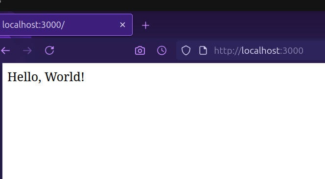
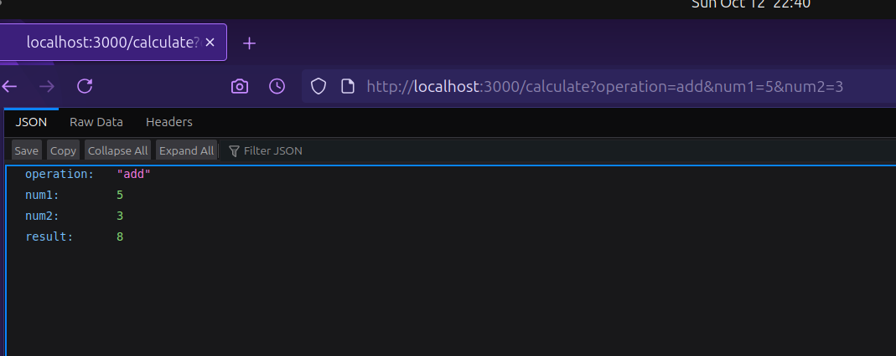

<h1 align="center">Advance Web Tech Lab Report</h1>

<h3>Name:Shahid Khan 
Sap Id:590018782
 Date: October 12, 2025 </h3>

<h2>
Experiment Index</h2>

1.  **Experiment 1:** Basic JQuery implementation
2.  **Experiment 2:** JQUERY CSS AND events methods
3.  **Experiment 3:** Angular js (table and sorting)
4.  **Experiment 4:** Angular JS Forms and Events
5.  **Experiment 5 & 6:** Node JS Basics
6.  **Experiment 7:** Cookie and Sessions in nodejs

## Experiment 1


## Experiment 1

1. **Aim**  
   To create a webpage with interactive features using HTML, CSS, and jQuery, including disabling right-click, scrolling to the top, changing paragraph color on mouseover, and showing/hiding a message.

2. **Brief Description**  
   This experiment develops a webpage featuring a button to disable right-click, an image to scroll to the top, a paragraph that changes color on mouseover, and a button to toggle the visibility of a message, all styled with CSS and controlled using jQuery.

3. **Explanation**  
   I created an HTML structure with a button, an image, a paragraph, and another button for message control. CSS was used to center the content, style the button and image, and position elements. jQuery handles the right-click disable on button click, scrolls to the top when the image is clicked, changes the paragraph color on hover, and toggles the message visibility with button text updates.

4. **All the code**  

   **index.html**  
   ```html
   <!-- EXPERIMENT 1  -->
   <!DOCTYPE html>
   <html lang="en">
   <head>
      <meta charset="UTF-8">
      <meta name="viewport" content="width=device-width, initial-scale=1.0">
      <title>Document</title>
      <script src="https://code.jquery.com/jquery-3.6.0.min.js"></script>
      <link rel="stylesheet" href="index.css">
   </head>
   <body>
      <button>DISABLE RIGHT CLICK
      </button>
      
      <p id="one">THIS PARAGRAPH WILL CHANGE IT'S COLOR ON MOUSEOVER</p>
      <h2 id="out">Button clicked</h2>
      <button id="sh">SHOW MESSAGE</button>
      <script src="index.js">
      </script>
   </body>
   </html>
   ```

   **index.css**  
   ```css
   body {
       display: flex;
       justify-content: center;
       align-items: center;
       height: 100vh;
       background-color: black;
       height: 1000px;
       color: rgb(183, 0, 255)
   }
   button {
       height: 150px;
       width: 200px;
       color: red;
       font-weight: 900;
   }

   /* scroll image to get to top */
   img {
       position: fixed;
       bottom: 20px;
       right: 10px;
       height: 100px
   }

   /* Change color on mouseover */
   #one {
       position: absolute;
       top: 30px;
   }

   /* show/hide message on button click */
   #out {
       display: none;
       top: 80px;
       position: absolute;
       color: brown;
   }
   ```

   **index.js**  
   ```javascript
   //DISABLE RIGHT CLICK 
   $(function(){
       $("button").on('click',function(){
           $("body").on('contextmenu',function(z)
       {
           z.preventDefault()
       })

       })
   });
   //CLICK IMAGE TO SCROLL TO TOP
   $(function(){
       $("#scrolltopimg").on('click',function(){
       $("body ,html").animate({scrollTop:0},500);
    });
   });

   //CHANGE PARAGRAPH COLOR ON MOUSEOVER
   $("p").hover(function(){
       $("#one").css({"color":"red","cursor":"pointer"});
   },
   function(){
   $(this).css("color","")
   })
   //show/hide message on button click
   $("#sh").on('click',function()
   {
       if($("#out").is(':hidden'))
       {   $("#out").show();
           $("#sh").text("HIDE MESSAGE")
       }
       else{
           $("#out").hide();
           $("#sh").text("SHOW MESSAGE")
       }
   })
   ```

5. **Paste output**  
   <code></code>

6. **What I learned**  
   I learned how to implement jQuery for event handling, DOM manipulation, and animations, along with CSS for layout and styling, to create an interactive webpage.

7. **Challenges Faced**  
   Ensuring the right-click disable triggered only after the button click and aligning the hover effect properly with CSS positioning were initial challenges.

## Experiment 2

1. **Aim**  
   To demonstrate the use of jQuery for manipulating CSS classes, retrieving element positions, and animating multiple CSS properties.

2. **Brief Description**  
   This experiment creates a webpage with three interactive sections: adding a CSS class to a paragraph, displaying an element's position, and animating a div with multiple CSS properties, all using jQuery and styled with CSS.

3. **Explanation**  
    I structured the HTML with three sections, each with a heading, an element to manipulate, and a button to trigger the action. CSS was used to style the elements and define the highlight and animation-complete classes. jQuery adds a class to a paragraph on button click, retrieves and displays an element's position on button click, and animates a div's properties on button click with a color change afterward.

4. **All the code**  

   **index.html**  
   ```html
   <!doctype html>
   <html>
   <head>
     <meta charset="utf-8">
     <title>Experiment 2 - jQuery CSS and Events</title>
     <link rel="stylesheet" href="style.css">
     <script src="https://code.jquery.com/jquery-3.6.0.min.js"></script>
   </head>
   <body>
     <div class="container">
       <h1>jQuery CSS & Events</h1>

       <section id="add-class">
         <h2>Add a class to an element</h2>
         <p id="para">This paragraph will change class when you click the button.</p>
         <button id="btn-add">Add .highlight</button>
       </section>

       <section id="position">
         <h2>Get element position</h2>
         <div id="pos-box">Position me</div>
         <button id="btn-pos">Show position</button>
         <p id="pos-output"></p>
       </section>

       <section id="animate">
         <h2>Animate multiple CSS properties</h2>
         <div id="anim-box">Animate me</div>
         <button id="btn-anim">Animate</button>
       </section>
     </div>

     <script src="app.js">
     </script>
   </body>
   </html>
   ```

   **style.css**  
   ```css
   body { font-family: Arial, sans-serif; padding: 20px; }
   .container { max-width: 800px; margin: auto; }
   #pos-box, #anim-box { border: 1px solid #333; padding: 10px; display:inline-block; margin:10px 0; }
   .highlight { background: #ffef9a; border-left: 4px solid #ffb347; padding: 6px; }
   .anim-done { color: #fff; background: #4caf50; }
   ```

   **app.js**  
   ```javascript
   $(document).ready(function() {
     // 1. Add class to an element
     $("#btn-add").click(function() {
       $("#para").addClass("highlight");
     });

     // 2. Access position of an element
     $("#btn-pos").click(function() {
       // position() gives position relative to offset parent
       const pos = $("#pos-box").position();
       // offset() gives document position
       const off = $("#pos-box").offset();
       $("#pos-output").text(`position: top=${pos.top}, left=${pos.left}  |  offset: top=${off.top.toFixed(1)}, left=${off.left.toFixed(1)}`);
     });

     // 3. Animate multiple CSS properties
     $("#btn-anim").click(function() {
       $("#anim-box").animate({
         paddingLeft: "40px",
         paddingRight: "40px",
         height: "80px"
       }, 700, function() {
         // after animation, change color via CSS class (color cannot be animated via jQuery animate without plugin)
         $(this).addClass("anim-done");
       });
     });
   });
   ```

5. **Paste output**  
   <p><strong>Output:</strong></p>
  <code ><code>
6. **What I learned**  
   I learned how to use jQuery to add CSS classes, retrieve element positions, and animate multiple properties, along with basic CSS styling for visual effects.

7. **Challenges Faced**  
   Understanding the difference between `position()` and `offset()` methods and ensuring the animation completed with the correct color change were initial hurdles.

## Experiment 3

1. **Aim**  
   To display a table using AngularJS with `ng-repeat`, sort table contents using the `orderBy` filter, and style rows differently for even and odd rows.

2. **Brief Description**  
   This experiment creates a webpage with two tables displaying student data, one with dynamic headers and rows using `ng-repeat`, and another sortable by name, age, or department with a reverse option, styled with alternating row colors using AngularJS.

3. **Explanation**  
    I set up an HTML structure with two tables and a dropdown for sorting. AngularJS was used to populate the tables with student data using `ng-repeat`, generate headers from the first row, and implement the `orderBy` filter with a checkbox for reverse sorting. CSS was applied to center the content and style the tables with different backgrounds for even and odd rows.

4. **All the code**  

   **index.html**  
   ```html
   <!DOCTYPE html>
   <html lang="en" ng-app="myapp">
   <head>
       <meta charset="UTF-8">
       <meta name="viewport" content="width=device-width, initial-scale=1.0">
       <title>Document</title>
       <link rel="stylesheet" href="style.css">
       <script src="https://ajax.googleapis.com/ajax/libs/angularjs/1.8.2/angular.min.js"></script>
   </head>
   <body ng-controller="mctrl">
       <p> 1. Display a table using AngularJS and `ng-repeat`.<br>
           2. Use `orderBy` filter to sort table contents.<br>
           3. Style rows differently for even and odd rows.</p>
           <br>
       <table ID="f" >
           <tr>
                <th ng-repeat="(key,value) in students[0]">{{key}}</th> 
                <!-- Prints the keys of data only once because it is bound to first row  -->
           </tr>
           <tr ng-repeat="student in students">
               <td ng-repeat="(key,value) in student">{{value}}</td>
           </tr>
       </table>
       <br>
       <section>
           Display contents with order by filter
           <label for="">Order BY:</label>
          <select name="" ng-model="sortkey" id="">
           <option value="name">Name</option>
           <option value="age">Age</option>
           <option value="dept">Dept</option>
          </select>
          <label for="">Reverse:
           <input type="checkbox" ng-model="reverse">
          </label>
       </section>
       <TABLE id="s">
           <tr><th>NAME</th>
           <TH>AGE</TH>
       <TH>DEPARTMENT</TH></tr>
       <tr ng-repeat="student in students|orderBy:sortkey:reverse">
           <!-- When the user choose sort by Name orderBy:sortkey changes to orderBy:Name and similarly so on
            and when  the value in checkbox is true then sorting is reversed-->
           <td>{{student.name}}</td>
           <td>{{student.age}}</td>
           <td>{{student.dept}}</td>
       </tr>
       </TABLE>
       <script src="app.js"></script>
   </body>
   </html>
   ```

   **style.css**  
   ```css
   /* Center content horizontally and stack vertically */
   body {
       display: flex;
       flex-direction: column;  /* stack tables one below the other */
       align-items: center;     /* center horizontally */
       margin: 0;
       padding: 20px;
       font-family: Arial, sans-serif;
   }

   /* General table styling */
   table {
       border-collapse: collapse;
       width: 300px;
       text-align: center;
       margin: 20px 0;          /* spacing between tables */
       box-shadow: 0 2px 6px rgba(0,0,0,0.2);
   }

   /* Borders */
   table, th, td {
       border: 2px solid black;
       padding: 8px;
   }

   /* Header row */
   th {
       background: #eee;
       font-weight: bold;
   }

   /* Odd-even row styling */
   tr.even { background: #f8f8f8; }
   tr.odd  { background: #191717; color: white; }

   /* Sections and paragraph layout */
   section, p {
       display: block;
       margin: 10px 0;
   }
   ```

   **app.js**  
   ```javascript
   var app =angular.module('myapp',[]);
   app.controller('mctrl',function($scope){
     $scope.students = [
         { name: 'Asha', age: 22, dept: 'CSE' },
         { name: 'Bikram', age: 24, dept: 'ECE' },
         { name: 'Charu', age: 21, dept: 'ME' },
         { name: 'Deep', age: 23, dept: 'CSE' },
         { name: 'Esha', age: 20, dept: 'EE' }
       ];
   })
   ```
   <p><strong>Output:</strong></p>


1. **What I learned**  
   I learned how to use AngularJS for dynamic table rendering with `ng-repeat`, implement sorting with the `orderBy` filter, and apply CSS to differentiate even and odd rows.

2. **Challenges Faced**  
   Ensuring the table headers were generated correctly from the first row and debugging the reverse sorting logic with the checkbox were initial difficulties.

## Experiment 4

1. **Aim**  
   To create a bill payment record system and a user registration form with input validation using AngularJS.

2. **Brief Description**  
   This experiment includes a bill payment record system with add, edit, and delete functionalities, and a separate registration form with basic input validation, both implemented using AngularJS with minimal styling.

3. **Explanation**  
   I created two HTML files: one for a bill payment system with a form to add or update bills and a table to display them, and another for a registration form with name and age fields. AngularJS handles form submission, data storage in memory, editing, and deletion for bills, while the registration form includes validation for required fields and minimum length, with error messages displayed on touch or submission.

4. **All the code**  

   **bill_payment.html**  
   ```html
   <!DOCTYPE html>
   <html ng-app="billApp">
   <head>
     <title>Bill Payment Record</title>
     <script src="https://ajax.googleapis.com/ajax/libs/angularjs/1.8.2/angular.min.js"></script>
   </head>
   <body ng-controller="billController">

     <h2>Bill Payment Record</h2>

     <!-- Form for Adding/Updating Bills -->
     <form ng-submit="saveBill()">
       <label>Bill Name:</label>
       <input type="text" ng-model="newBill.name" placeholder="e.g. Electricity" required>
       <br><br>

       <label>Amount:</label>
       <input type="number" ng-model="newBill.amount" placeholder="e.g. 1200" required>
       <br><br>

       <label>Date:</label>
       <input type="date" ng-model="newBill.date" required>
       <br><br>

       <button type="submit">{{ editIndex === -1 ? "Add Bill" : "Update Bill" }}</button>
       <button type="button" ng-click="clearForm()">Clear</button>
     </form>

     <hr>

     <!-- Display Bills -->
     <h3>All Bills</h3>
     <table border="1" cellpadding="8">
       <tr>
         <th>#</th>
         <th>Bill Name</th>
         <th>Amount</th>
         <th>Date</th>
         <th>Actions</th>
       </tr>
       <tr ng-repeat="bill in bills track by $index">
         <td>{{$index + 1}}</td>
         <td>{{bill.name}}</td>
         <td>{{bill.amount}}</td>
         <td>{{bill.date | date : 'dd-MM-yyyy'}}</td>
         <td>
           <button ng-click="editBill($index)">Edit</button>
           <button ng-click="deleteBill($index)">Delete</button>
         </td>
       </tr>
     </table>

     <script>
       var app = angular.module("billApp", []);
       app.controller("billController", function($scope) {
         $scope.bills = []; // in-memory storage
         $scope.newBill = {};
         $scope.editIndex = -1;

         // Save (Add or Update)
         $scope.saveBill = function() {
           if ($scope.editIndex === -1) {
             // Add new bill
             $scope.bills.push({
               name: $scope.newBill.name,
               amount: $scope.newBill.amount,
               date: $scope.newBill.date
             });
           } else {
             // Update existing bill
             $scope.bills[$scope.editIndex] = angular.copy($scope.newBill);
             $scope.editIndex = -1;
           }
           $scope.newBill = {}; // clear form
         };

         // Edit a bill
         $scope.editBill = function(index) {
           $scope.newBill = angular.copy($scope.bills[index]);
           $scope.editIndex = index;
         };

         // Delete a bill
         $scope.deleteBill = function(index) {
           $scope.bills.splice(index, 1);
         };

         // Clear form
         $scope.clearForm = function() {
           $scope.newBill = {};
           $scope.editIndex = -1;
         };
       });
     </script>

   </body>
   </html>
   ```

   **registration.html**  
   ```html
   <!-- Create a user registration form and perform input validation using AngularJS. -->
   <!DOCTYPE html >
   <html lang="en" ng-app="app">
   <head>
       <meta charset="UTF-8">
       <meta name="viewport" content="width=device-width, initial-scale=1.0">
       <title>Document</title>
       <link rel="stylesheet" href="style.css">
       <script src="https://ajax.googleapis.com/ajax/libs/angularjs/1.8.2/angular.min.js"></script>
   </head>
   <body ng-controller="ctr">
     <h1>REGISTRATION PAGE</h1>
   <form name="reg" ng-submit="submitform()">
     <label >Enter your name:
       <input type="text" name="name" ng-model="name" required ng-minlength="3"></label>
     <div class="error"  ng-show="(reg.name.$touched || submitted) && reg.name.$error.required" >
       Name must be entered correctly</div>

       <br>
       <label for="age"> AGE:
         <input type="number" ng-model="age" name="age">
         <div id="ageerror" ng-show="(reg.age.$touched ||submitted) && re.age.$error.required">
           Age Must be a number
         </div>
       </label>
     <button type="submit" name="btn" >Submit</button>
   </form>
      <script>
   var app =angular.module('app',[]);
   var ctrl =app.controller('ctr',function($scope){
     $scope.submitted=false;
     $scope.submitform=function(){
       $scope.submitted=true

     }

   })

      </script>
   </body>
   </html>
   ```

   **style.css**  
   ```css
   body {
       min-height: 100vh;
       display: flex;
       justify-content: center;
       align-items: center;
       background: #f0f0f0;
       flex-direction: column;
   }
   h1{display: block;text-align: center;}
   #hcontainer{text-align: center;top:20px}
   #reg {
       width: 400px;
       height: 700px;
       background-color: rgba(0,0,0,0.5); 
       border-radius: 10px;
       box-shadow: 0 4px 16px rgba(0,0,0,0.2);
       padding: 32px 24px;
       display: flex;
       flex-direction: column;
       justify-content: center;
   }
   ```

        <p><strong>Output:</strong></p>


     <p><strong>Output:</strong></p>


 **What I learned**  
   I learned how to use AngularJS for form handling, data management, and input validation, including dynamic table updates and error messaging.

1. **Challenges Faced**  
   Fixing the typo in the age validation condition (`re.age` to `reg.age`) and ensuring form clearing worked correctly after submission were initial issues.

## Experiment 5 & 6

1. **Aim**  
   To set up a Node.js server with endpoints for a Hello World message, string replacement, calculation, and array iteration.

2. **Brief Description**  
   This experiment creates a single Node.js server with multiple GET endpoints: a basic Hello World, a string replacement function, a calculator for basic operations, and an array iteration example using different loop types, all handled with Express.

3. **Explanation**  
    I set up an Express server and defined four endpoints. The root endpoint returns a simple message, the `/replace` endpoint replaces multiple consecutive 'a's with 'b' in a query string, the `/calculate` endpoint performs arithmetic operations based on query parameters, and the `/iterate` endpoint demonstrates array iteration using for loop, forEach, and for...of, logging results in JSON.

4. **All the code**  

   **index.js**  
   ```javascript
   const express = require('express');
   const app = express();
   const port = 3000;
   // Hello World endpoint
   app.get('/', (req, res) => {
     res.send('Hello, World!');
   });
   // String replacement endpoint
   app.get('/replace', (req, res) => {
     const { text } = req.query;
     if (!text) {
       return res.status(400).json({ error: 'Text parameter is required' });
     }
    
     const regex = /a{2,}/g;
     const result = text.replace(regex, 'b');
     res.json({ original: text, replaced: result });
   });
   // Calculator endpoint
   app.get('/calculate', (req, res) => {
     const { operation, num1, num2 } = req.query;
     const n1 = parseFloat(num1);
     const n2 = parseFloat(num2);
    
     if (isNaN(n1) || isNaN(n2)) {
       return res.status(400).json({ error: 'Invalid numbers provided' });
     }
    
     let result;
     switch(operation) {
       case 'add':
         result = n1 + n2;
         break;
       case 'subtract':
         result = n1 - n2;
         break;
       case 'multiply':
         result = n1 * n2;
         break;
       case 'divide':
         result = n2 !== 0 ? n1 / n2 : 'Error: Division by zero';
         break;
       default:
         return res.status(400).json({ error: 'Invalid operation. Use add, subtract, multiply, or divide' });
     }
    
     res.json({ operation, num1: n1, num2: n2, result });
   });
   // Array iteration endpoint
   app.get('/iterate', (req, res) => {
     const array = [10, 20, 30, 40, 50];
     const iterations = [];
    
     // Using for loop
     iterations.push("Using for loop:");
     for (let i = 0; i < array.length; i++) {
       iterations.push(`Index ${i}: ${array[i]}`);
     }
    
     // Using forEach
     iterations.push("Using forEach:");
     array.forEach((item, index) => {
       iterations.push(`Index ${index}: ${item}`);
     });
    
     // Using for...of
     iterations.push("Using for...of:");
     for (const item of array) {
       iterations.push(`Item: ${item}`);
     }
    
     res.json({ array, iterations });
   });
   app.listen(port, () => {
     console.log(`Server running at http://localhost:${port}`);
     console.log('Available endpoints:');
     console.log(' GET / - Hello World');
     console.log(' GET /replace?text=your_text - Replace multiple a\'s with b');
     console.log(' GET /calculate?operation=add&num1=5&num2=3 - Calculator');
     console.log(' GET /iterate - Array iteration examples');
   });
   ```

   <p><strong>Output:</strong></p>


< p><strong>Output:</strong></p>
  

    <p><strong>Output:</strong></p>


<p><strong>Output:</strong></p>

   1. **What I learned**  
   I learned how to create a Node.js server with Express, handle multiple endpoints, perform string manipulation with regex, implement a calculator with switch cases, and demonstrate array iteration methods.

   2. **Challenges Faced**  
   Handling query parameter validation and ensuring the server logged endpoint details correctly were initial challenges.

## Experiment 7

1. **Aim**  
   To demonstrate cookie and session management in a Node.js application using Express.

2. **Brief Description**  
   This experiment sets up a Node.js server with endpoints to set, get, and delete cookies, and another to manage session views, using Express with cookie-parser and express-session.

3. **Explanation**  
    I created two Express applications: one for cookie management with endpoints to set, retrieve, and clear a cookie, and another for session management to track page visits with a destroy option. Both use middleware to handle cookies and sessions, with the session tracking incrementing views on each visit.

4. **All the code**  

   **package.json**  
   ```json
   {
     "name": "experiment_7",
     "version": "1.0.0",
     "main": "index.js",
     "scripts": {
       "test": "echo \"Error: no test specified\" && exit 1"
     },
     "keywords": [],
     "author": "",
     "license": "ISC",
     "description": "",
     "dependencies": {
       "cookie-parser": "^1.4.7",
       "express": "^5.1.0",
       "express-session": "^1.18.2"
     }
   }
   ```

   **cookie_index.js**  
   ```javascript
   const express = require('express');
   const cookieParser = require('cookie-parser');

   const app = express();
   app.use(cookieParser());
   app.get('/', (req, res) => {
       res.send('hello')
   });
   app.get('/set-cookie', (req, res) => {
       res.cookie('username', 'John', { maxAge: 900000 });
       res.send('Cookie has been set');
   });

   app.get('/get-cookie', (req, res) => {
       const user = req.cookies['username'];
       res.send(`Cookie Retrieved: ${user}`);
   });

   app.get('/delete-cookie', (req, res) => {
       res.clearCookie('username');
       res.send('Cookie deleted');
   });

   app.listen(3000, () => {
       console.log('Server running on http://localhost:3000');
   });
   ```

   **session_index.js**  
   ```javascript
   const express = require('express');
   const session = require('express-session');

   const app = express();

   app.use(session({
       secret: 'mysecretkey',
       resave: false,
       saveUninitialized: true
   }));

   app.get('/', (req, res) => {
       if (req.session.views) {
           req.session.views++;
           res.send(`Welcome back! You visited ${req.session.views} times.`);
       } else {
           req.session.views = 1;
           res.send('Welcome to the session demo. Refresh to count visits.');
       }
   });

   app.get('/destroy', (req, res) => {
       req.session.destroy(err => {
           if (err) {
               return res.send('Error destroying session');
           }
           res.send('Session destroyed');
       });
   });

   app.listen(3000, () => {
       console.log('Server started on http://localhost:3000');
   });
   ```

        <p><strong>Output:</strong></p>


    <p><strong>Output:</strong></p>


    <p><strong>Output:</strong></p>


    <p><strong>Output:</strong></p>


    <p><strong>Output:</strong></p>


5. **What I learned**  
   I learned how to manage cookies and sessions in Node.js using Express middleware, including setting, retrieving, and clearing cookies, and tracking session visits.

6. **Challenges Faced**  
   Resolving port conflicts between the cookie and session servers and ensuring session persistence across requests were initial difficulties.